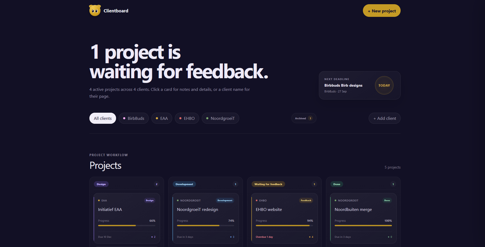
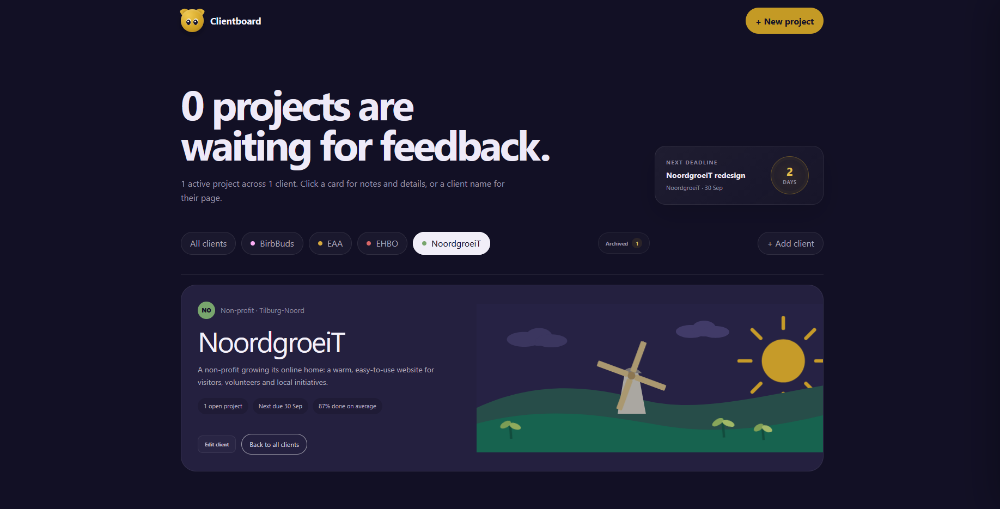
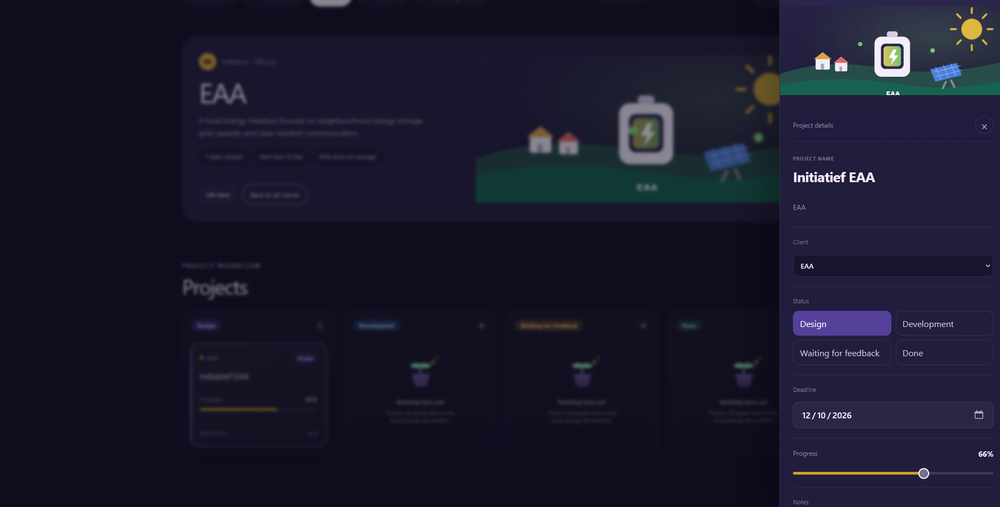
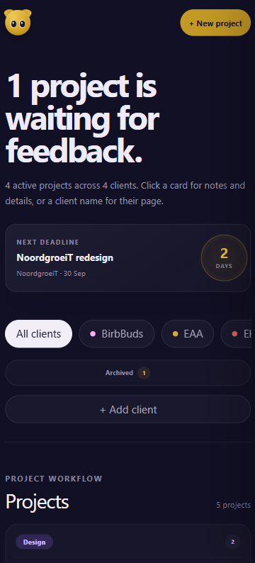

# Clientboard

A visual client and project management dashboard built with Laravel.

Clientboard started as a practice project for learning Laravel, but grew into a fully interactive dashboard for managing clients, projects, deadlines, progress, notes and project status.

The project focuses heavily on frontend polish and interaction design while still using a proper Laravel backend and database structure.

---

## ✨ Features

- Client filtering and individual client dashboards
- Kanban-style project workflow
- Project status management
- Progress tracking
- Editable deadlines
- Project notes
- Client reassignment
- Editable project titles
- Create and edit clients
- Archive and restore projects
- Permanently delete archived projects
- Dynamic next-deadline widget
- Custom visual identity for different clients
- Responsive mobile layout
- Keyboard navigation
- Reduced-motion support
- Interactive animated mascot

---

## 🛠 Tech stack

**Backend**
- Laravel
- PHP
- SQLite
- Eloquent ORM

**Frontend**
- Blade
- JavaScript
- CSS
- Tailwind CSS
- Vite

---

## 🎨 Design

Clientboard uses a dark purple interface with warm yellow accents and custom animated illustrations.

Each client can have its own visual identity while still fitting into the overall Clientboard design system.

The interface includes:

- Animated client illustrations
- Interactive hover states
- Custom empty states
- Responsive Kanban layouts
- Drawer-based project editing
- Modal forms
- Micro-interactions and save feedback
- A small cursor-following mascot

Accessibility was also considered during the polish phase, including keyboard focus states and support for `prefers-reduced-motion`.

---

## 📸 Screenshots

### Dashboard

The main dashboard combines project status, deadlines, client filtering and a Kanban-style workflow.



### Client workspace

Each client has its own overview with project statistics, client information and a custom visual identity.



### Project details

Projects can be managed directly from the project drawer, including status, deadline, progress, client assignment and notes.



### Responsive design

Clientboard was designed to remain usable on smaller screens, with horizontally scrollable client filters and a single-column project workflow.

<p align="center">
    
</p>

---

## 🚀 Local setup

Clone the repository:

```bash
git clone YOUR_REPOSITORY_URL
cd clientboard